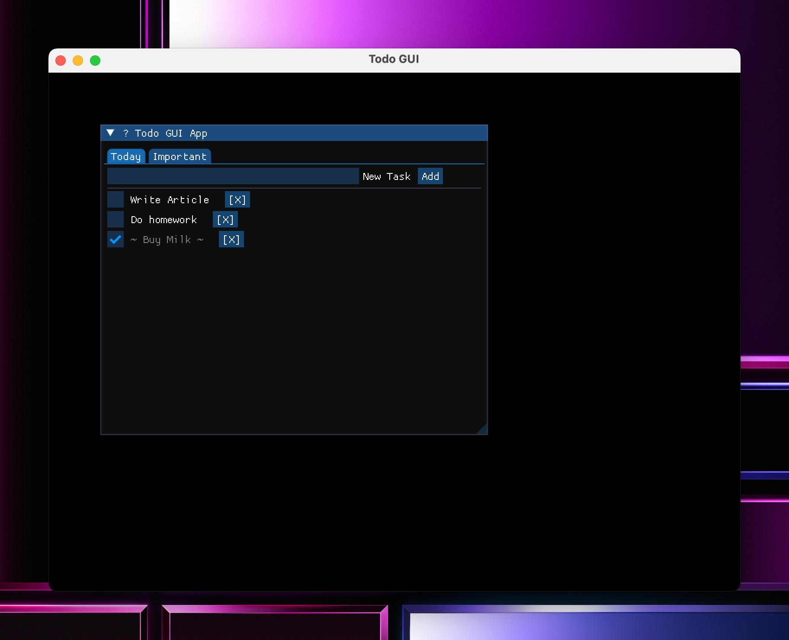

# 📝 Todo GUI (C++ & ImGui)

A simple cross-platform GUI Todo App built with **C++**, **GLFW**, and **Dear ImGui**.  
Designed to demonstrate GUI programming using ImGui + task persistence using file I/O.

## 📸 Screenshot




## 🎯 Features

- Add tasks
- Mark as done (with strike-through and reorder)
- Two categories: Today / Important
- Save/load from local file `todo.txt`

## 🚀 Build & Run

```bash
make
./todo-gui
```

## 🔧 Requirements
g++

GLFW

OpenGL (macOS: enable forward-compatible)

